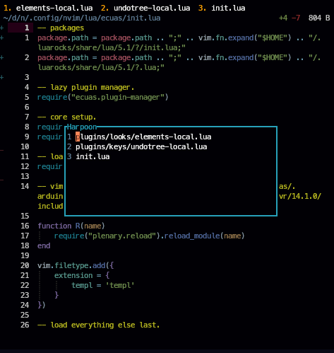
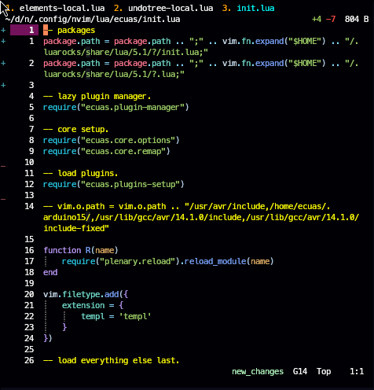
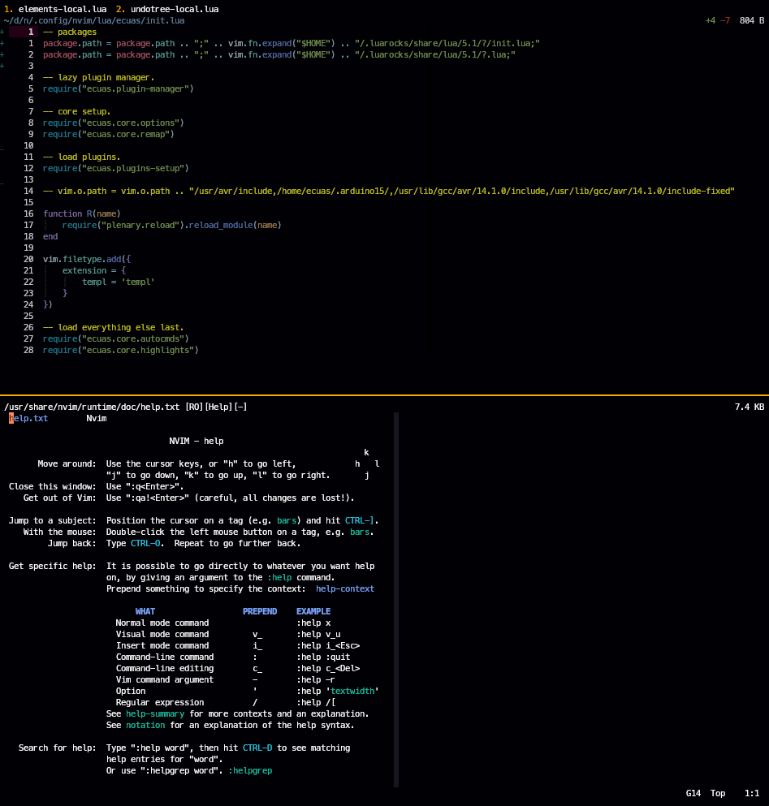
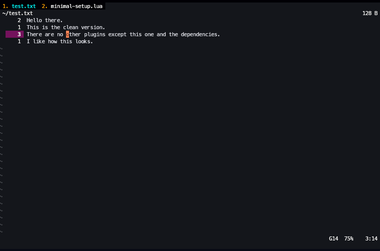
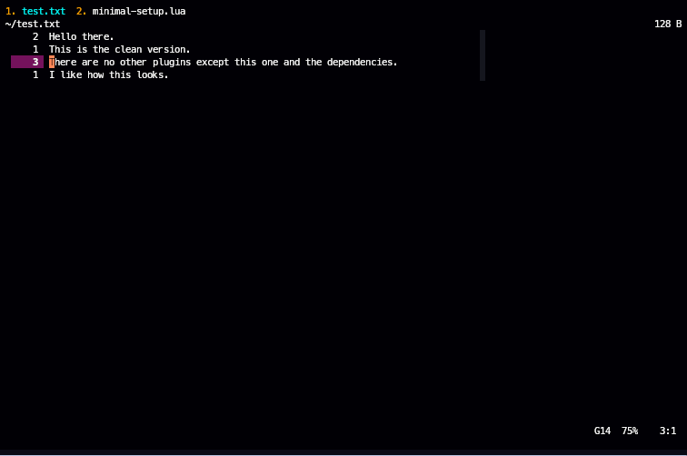

# Simple Elements Layout
## Features
### 1. Tabline:
- Tabline incorporates Harpoon.nvim such that saved files will show up on the tabline in the specific order that Harpoon has them in.<br>
 <br>
 <br>
### 2. Statusline and Winbar:
- `vim.opt.laststatus = 3` by default, meaning that there is a single statusline, and it reflects the contents of the active window. <br>
    - If `vim.opt.laststatus` is set such that there are multiple statuslines, each statusline will reflect the contents of its respective window and not that of the active window. <br>
- Statusline includes Branch Name through Vim-Fugitive plugin.<br>
### 3. Winbar:
- Each winbar displays information (such as window path) of its respective window and not that of the active window.
- Winbar includes Diagnostics and Git Signs through Gitsigns plugin.<br>
- Winbar path is automatically truncated on based on the current size its respective window.
    - There is a local variable within `./lua/elements/winbar.lua` called `max_path_length`.
<br>
### 4. Extremely Lightweight.
### 5. Only Necessary Autocmds.

## Clean Setup
Download and run the file in `minimal-setup.lua`. <br>
See if plugin works out of the box with no interferences.<br>

## Layouts
Clean Layout:<br>


Personal Layout:<br>


## Example Lazy Setup
```lua
    {
        "ecuasonic/elements.nvim",
        dependencies = {
            {
                "theprimeagen/harpoon",
                branch = "harpoon2",
                dependencies = { "nvim-lua/plenary.nvim" },
                config = function()
                    local harpoon = require("harpoon")
                    harpoon.setup()

                    vim.keymap.set("n", "<leader>a", function() harpoon:list():add() end,
                        { desc = "Add current file to Harpoon." })
                    vim.keymap.set("n", "<leader>h", function() harpoon.ui:toggle_quick_menu(harpoon:list()) end,
                        { desc = "Toggle Harpoon menu" })

                    vim.keymap.set("n", "<Space>1", function() harpoon:list():select(1) end,
                        { desc = "harpoon to file 1" })
                    vim.keymap.set("n", "<Space>2", function() harpoon:list():select(2) end,
                        { desc = "harpoon to file 2" })
                    vim.keymap.set("n", "<Space>3", function() harpoon:list():select(3) end,
                        { desc = "harpoon to file 3" })
                    vim.keymap.set("n", "<Space>4", function() harpoon:list():select(4) end,
                        { desc = "harpoon to file 4" })
                    vim.keymap.set("n", "<Space>5", function() harpoon:list():select(5) end,
                        { desc = "harpoon to file 5" })
                    vim.keymap.set("n", "<Space>6", function() harpoon:list():select(6) end,
                        { desc = "harpoon to file 6" })
                    vim.keymap.set("n", "<Space>7", function() harpoon:list():select(7) end,
                        { desc = "harpoon to file 7" })
                    vim.keymap.set("n", "<Space>8", function() harpoon:list():select(8) end,
                        { desc = "harpoon to file 8" })
                end
            },
            "lewis6991/gitsigns.nvim",
            "tpope/vim-fugitive",
        },
        config = function()
            require('elements')
        end
    },
```

## Notes
For personal use only.<br>
Currently not modifiable through package manager plugin config.<br>
Must use `vim.opt.relativenumbers` and `vim.opt.numbers` (is currently set by plugin).<br>
Uses autocmnds with `CursorHold` so `vim.opt.updatetime = 50`.<br>
Highlights used are in `/lua/utils/highlights.lua`.<br>
